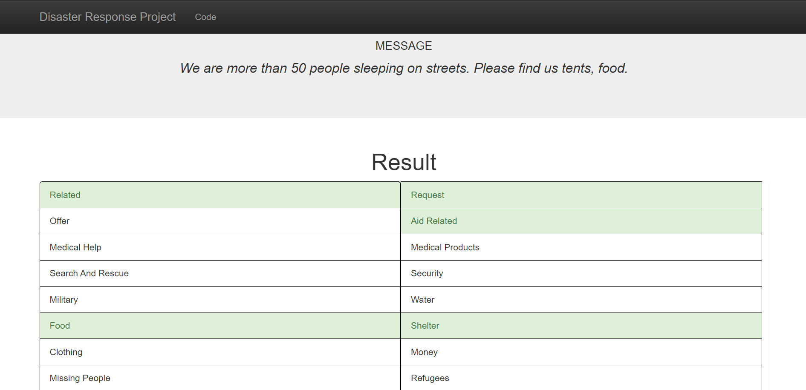

# Disaster Response Messages Classification

## Motivation

During disasters, the relief providing organizations receive millions of messages for help. To aid in quick response
according to the severity, we can group these messages into categories so that 
the responsible department can swiftly deal with it. In this project, we
use machine learning to categorize disaster messages into 35 distinct groups. 

## Libraries Required

1. Pandas
2. Numpy
3. Scikit-Learn
4. Plotly
5. NLTK
6. SQLAlchemy
7. XGBoost

## File Descriptions

1. <b>data/process_data.py</b>: Load the data into dataframe, perform
data cleaning such as removing nulls and duplicates, etc. Finally,
storing the data in a SQLite database.

2. <b>models/train_classifier.py</b>: Load the data from the database, 
preprocess the text messages, train, test, tune and evaluate the machine learning
algorithm and save the trained model.

3. <b>app (folder)</b>: Contains the html, and css code for the application
front-end.

4. <b>app/run.py</b>: Runs the flask application and contains
code for rendering templates and visualizations.
 
 ## App Screenshot
 
  